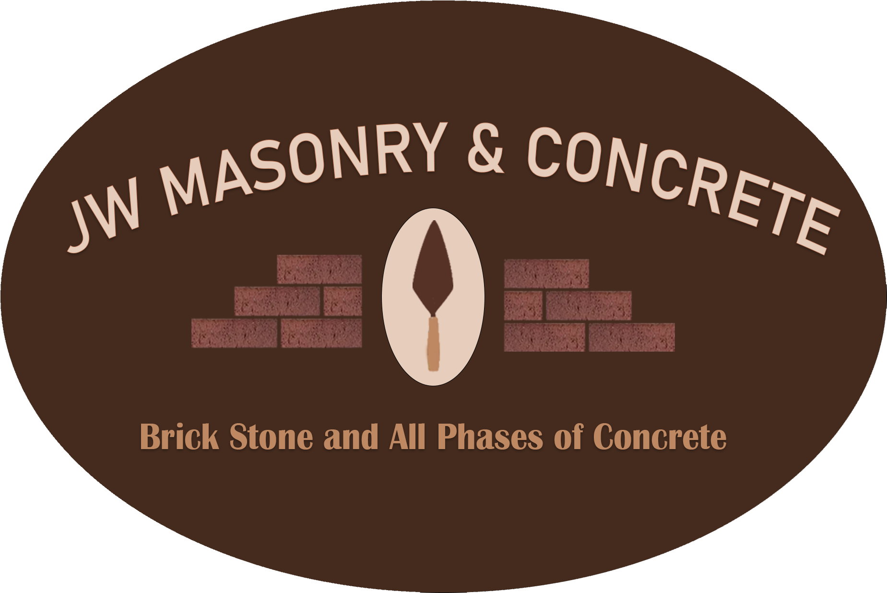
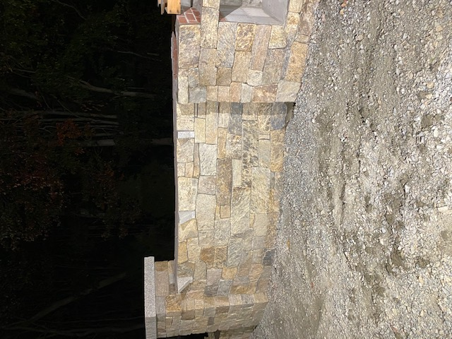

<!DOCTYPE html>
<!--[if lt IE 7]>      <html class="no-js lt-ie9 lt-ie8 lt-ie7"> <![endif]-->
<!--[if IE 7]>         <html class="no-js lt-ie9 lt-ie8"> <![endif]-->
<!--[if IE 8]>         <html class="no-js lt-ie9"> <![endif]-->
<!--[if gt IE 8]>      <html class="no-js"> <!--<![endif]-->
<html>
    <head>
        <link rel="stylesheet" href="https://www.w3schools.com/w3css/4/w3.css">
        <link rel="stylesheet" href="https://fonts.googleapis.com/icon?family=Material+Icons">
        <meta charset="utf-8">
        <meta http-equiv="X-UA-Compatible" content="IE=edge">
        <title>JW Masonry & Concrete</title>
        <meta name="description" content="">
        <meta name="viewport" content="width=device-width, initial-scale=1">
        <link href="https://fonts.googleapis.com/css2?family=Patua+One&display=swap" rel="stylesheet">
        
    </head>
    <body>
        
    

        

          <b>JW</b> Masonry & Concrete
          

          <!-- Float links to the right. Hide them on small screens -->
          

              
           <!-- <a href="#projects" class="w3-bar-item w3-text-black w3-button">Projects</a>
            <a href="#about" class="w3-bar-item w3-text-black w3-button">About</a>
            <a href="#contact" class="w3-bar-item w3-text-black w3-button">Contact</a>-->
          

        

      

        <!--[if lt IE 7]>
            
You are using an <strong>outdated</strong> browser. Please <a href="#">upgrade your browser</a> to improve your experience.

              
  

        <![endif]-->
        <header class="w3-display-container w3-content" style="width:100%" id="home">
            
            
          </header>
          
          

            
          

          
          
          
           <h3 class="w3-text-white w3-center" style="font-family: 'Patua One', cursive;">Contact Us For A Free Estimate : </h3>
            
           
<a href="tel:1-774-235-4928" class="w3-btn w3-animate-left"><i class="material-icons " style="font-size:32px;color:green;">phone</i></a> 1-774-235-4928

            
<a href="mailto:jwmasonryconcrete@gmail.com" class="w3-btn w3-animate-left" ><i class="material-icons " style="font-size:32px;color:blue;">email</i> </a>  jwmasonryconcrete@gmail.com

          
       
      

    

          
 

<!-- Project Section -->

  <h3 class="w3-border-bottom w3-border-light-grey w3-padding-16 w3-text-white w3-center" style="font-family: 'Patua One', cursive;">We Specialize In : </h3>

<!--

  

    

      
Brickwork

      
    

  

  

    

      
Concrete

      
    

  

  

    

      
Stonework

      
    

  

-->

  

    

  

    
Brickwork

    
    
    
    <button class="w3-button w3-https://jwmasonryandconcrete.github.io/black w3-display-left" onclick="plusDivs(-1, 0)">&#10094;</button>
    <button class="w3-button w3-https://jwmasonryandconcrete.github.io/black w3-display-right" onclick="plusDivs(1, 0)">&#10095;</button>
  
 

  

  

    
Concrete

    
    
    
    
    
    <button class="w3-button w3-black w3-display-left" onclick="plusDivs(-1, 1)">&#10094;</button>
    <button class="w3-button w3-black w3-display-right" onclick="plusDivs(1, 1)">&#10095;</button>
  

  

    

      
Stonework

      
      
      
      
      <button class="w3-button w3-black w3-display-left" onclick="plusDivs(-1, 2)">&#10094;</button>
      <button class="w3-button w3-black w3-display-right" onclick="plusDivs(1, 2)">&#10095;</button>
    
 

  
  

       <!-- About Section d -->
       

        

          With over 25 years of professional experience, JW Masonry & Concrete will ensure our client's expectations are fully satisfied.   
 
          Highly professional fully insured all weather crew are capable of meeting and exceeding all clients demands in relation to :  

          <ul class="w3-ul" style="font-family: 'Patua One', cursive;">
            <li>Patios</li>
            <li>Walls</li>
            <li>Chimney Repair</li>
            <li>Finishwork</li>
            <li>Stone Facades</li>
            <li>Counters</li>
            <li>Basements</li>
          </ul>
          
        

    
    

<!-- Footer -->
<footer class="w3-center  w3-padding-16" style="background-color:#452d1d">
  
Copyright 2020 - JW Masonry & Concrete LLC  All rights reserved.

</footer>
        
        

    </body>
</html>

<!-- <a href="tel:401-444-4444" class="w3-bar-item w3-text-black-button"><b></b><i class="material-icons" style="font-size:24px;color:black;">phone</i> 401-444-4444 -->
